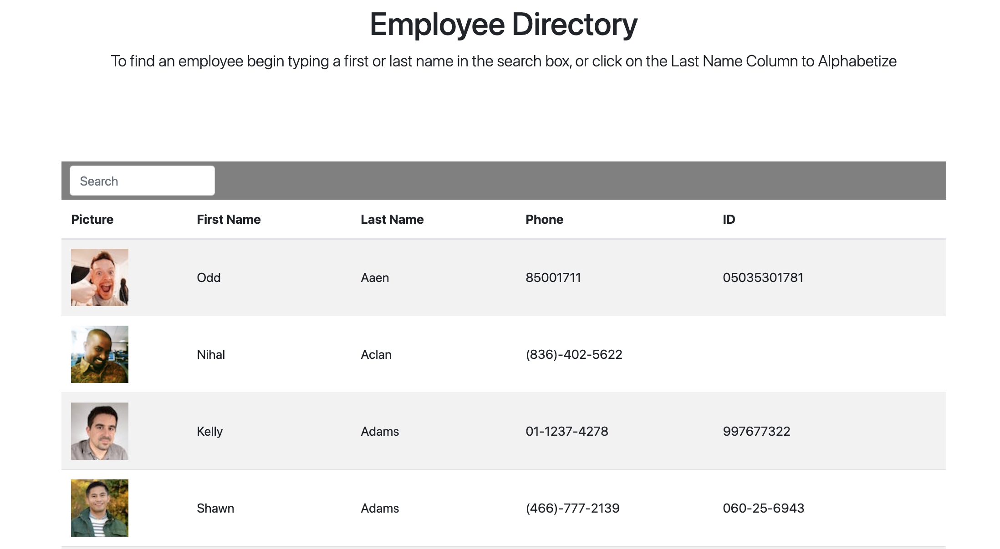

# Employee Directory

  
  

---

## Table of Contents
- [About the Project](#About-the-Project)
- [Getting Started](#Getting-Started)
- [Installation](#Installation)
- [Contributing](#Contributing)
- [Testing](#Testing)
- [License](#License) 

## About the Project
This is a React Application that presents the use with a list of employees, the list can be filtere and also sorted by last name.  
  
## Getting Started  
To get started, follow the Installation instructions below.    
    

### Installation  
Run the following command in your terminal to install required dependencies:  
npm install,  
to run it on your browers use npm start from your terminal to launch the App locally.

## Testing
No testing required.
  

## Contributing
To contribute to this project contact Sam Rodriguez.  
Github Repository URL:  https://github.com/samrod777/employee-directory 

To see the App live follow the below link:

## License
This application is covered under the MIT license.  

